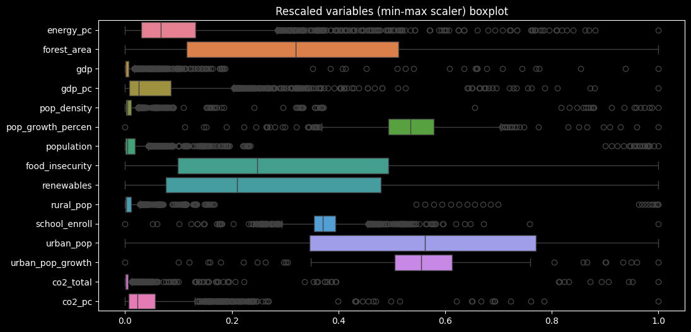
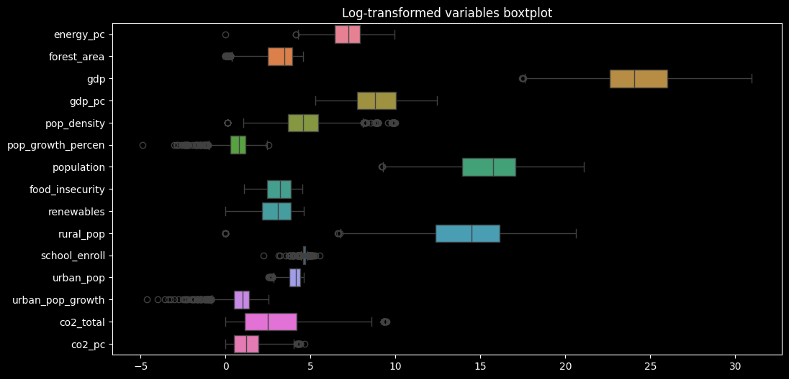
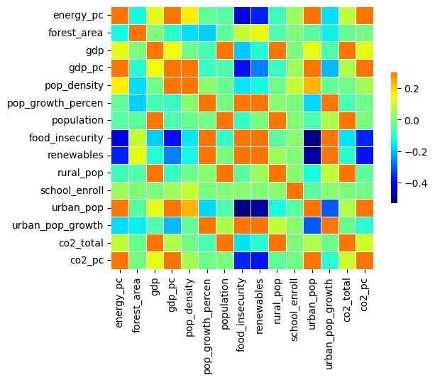
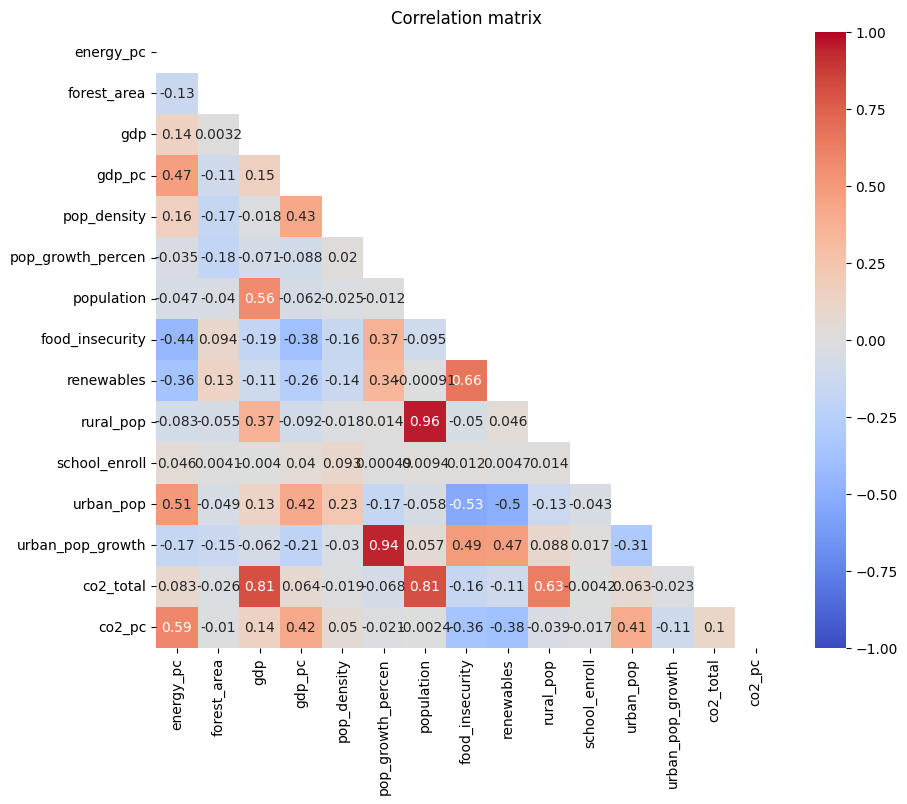
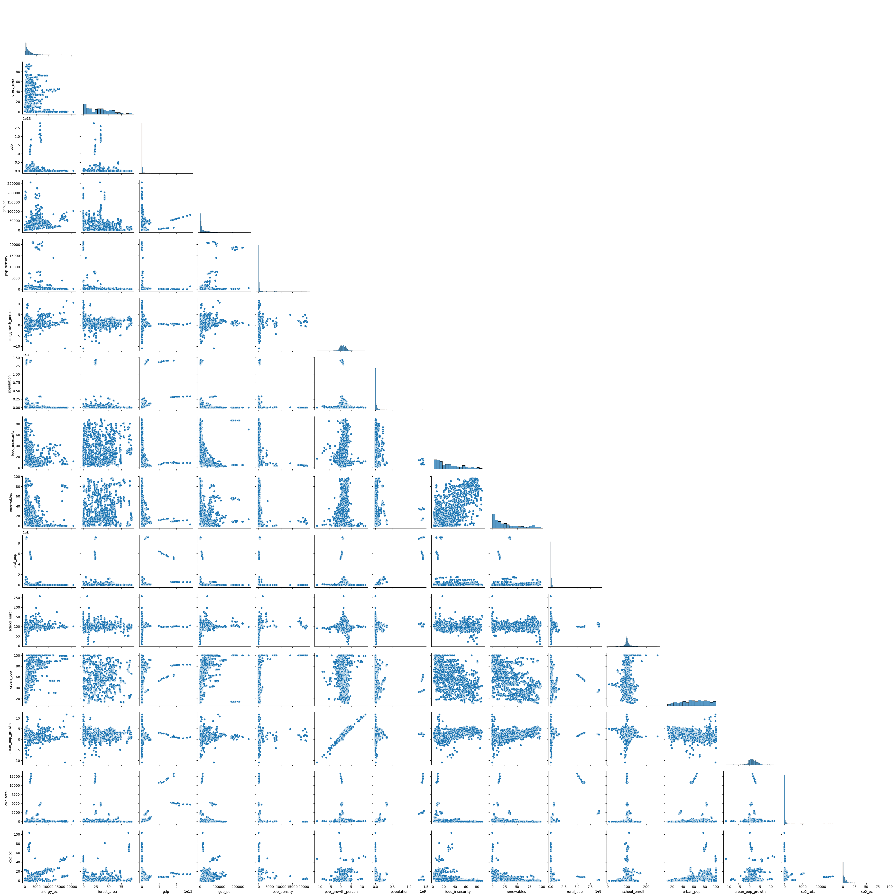

# Question 1: Comprehensive Data Acquisition and Preprocessing

**Task**: Download and preprocess CO2 emissions data along with a wide range of socio-economic 
and environmental indicators from the World Bank’s Climate Change database.

Instructions: 
1. Access the World Bank database using Python, R, or MATLAB. 
2. Download CO2 emissions data and as many relevant socio-economic and environmental 
indicators as possible (e.g., GDP, population, energy consumption, urbanization rate, 
education level, etc.). 
3. Clean and preprocess the data, addressing missing values, outliers, and ensuring 
consistency across indicators. 
4. Provide a detailed summary of the dataset, including key statistics, correlations between 
variables, and any notable patterns or anomalies.

Deliverable: 
- A script that downloads, preprocesses, and summarizes the data with an emphasis on 
integrating a wide range of predictors (*Q.1.ipynb file*). 
- A Markdown file summarizing key statistics, correlations, and preprocessing steps (*Q.1.md file*). 

## Instructions: 

Please execute all the code chunks in the Q.1.ipynb file (click top button "run all"). 

The downloading and preprocessing steps were performed in a Jupyter notebook to take advantage of its lineal approach to download, preprocess and visualize data in a interactive and easy to follow way. 

## 1. Downloading steps 

The possible variables to compose the resulting DataFrame were explored using WBGAPI, the World Bank's official API for accessing their data.

After listing avaiable variables with the keyword "CO2", different keywords such as population, development and energy  were applied as in the following example: *"wb.series.info(q='keyword')"* . 

### 2. Variables 

Following the instructions, the target variable is: 

- 'EN.GHG.CO2.MT.CE.AR5'
    
Which is the carbon dioxide (CO2) emissions (total) excluding LULUCF (Mt CO2e). 

Aditionally, the following variable was included since it may be more useful to compare countries with very different populations and provides a clearer analysis in the emissions per person. 

- 'EN.GHG.CO2.PC.CE.AR5' 

Which is the carbon dioxide (CO2) emissions excluding LULUCF per capita (t CO2e/capita)

#### *Socioeconomic and environmental variables*:  

The complete list of variables is in table 1; the socioeconomic and environmental variables were chosen as predictors to model the target variable for their possible direct relation with it. Also the name of the country and year of the register were included as variables.

| Variable name          | WDI Code                 | Description                                                                 |
|------------------------|---------------------------|-----------------------------------------------------------------------------|
| co2_total              | EN.GHG.CO2.MT.CE.AR5     | Total CO₂ emissions (excl. LULUCF, Mt)                                      |
| co2_pc                 | EN.GHG.CO2.PC.CE.AR5     | CO₂ emissions per capita                                                    |
| population             | SP.POP.TOTL              | Total population                                                            |
| gdp                    | NY.GDP.MKTP.CD           | Gross Domestic Product (GDP), current US$                                   |
| gdp_pc                 | NY.GDP.PCAP.CD           | GDP per capita                                                              |
| urban_pop              | SP.URB.TOTL.IN.ZS        | Urban population (% of total population)                                    |
| energy_pc              | EG.USE.PCAP.KG.OE        | Energy use per capita (kg of oil equivalent)                                |
| forest_area            | AG.LND.FRST.ZS           | Forest area (% of land area)                                                |
| renewables             | EG.FEC.RNEW.ZS           | Renewable energy consumption (% of total final energy use)                  |
| school_enroll          | SE.PRM.ENRR              | Primary school enrollment (% gross)                                         |
| pop_density            | EN.POP.DNST              | Population density (people per sq. km of land area)                         |
| food_insecurity        | SN.ITK.MSFI.ZS           | Prevalence of moderate or severe food insecurity in the population (%)      |
| pop_growth_percen      | SP.POP.GROW              | Population growth (annual %)                                                |
| rural_pop              | SP.RUR.TOTL              | Rural population                                                            |
| urban_pop_growth       | SP.URB.GROW              | Urban population growth (annual %)                                          |

Table 1. Complete list of variables chosen for the analysis. 

### 3. Preprocessing steps

For an easier manipulation, columns were renamed with the data registered in the *Variable name* column from table 1. Economic regions (which were included in the downloaded data) were discarted, keeping only countries. 

After noticing the presence of missing data on some variables, the algorithm K-Nearest Neighbours was applied to interpolate data in null values. This technique has it's own advantages and disadvantages, but is considered less prone to biass than filling in the missing values with a constant value or a measure of centrality such as the mean or median (which in this case i considered not appropriate due to the large differences between countries with different contexts). The imputation was applied setting the hyperparameter of number of neighbours as five, and applying a weighted mean based on the distance of each neighbour. 

### 4. Results

#### *Descriptive statistics* 

Table 1 contains the summary of the dataframe. Also, a summary of the descriptive statistics for each country can be observed in Q.1.ipynb file. 

|                       |          mean |           std |           min |           25% |           50% |           75% |            max |
|-----------------------|---------------|---------------|---------------|---------------|---------------|---------------|----------------|
| energy_pc             |   2256.242128 |   2653.005438 |       0.000000 |     616.151115 |    1387.979560 |    2725.035850 |     20642.143000 |
| forest_area           |     31.745576 |     23.906706 |       0.000000 |      10.944467 |      30.464259 |      48.771398 |        95.141567 |
| gdp                   | 411488204358. | 1849843136875.|  36811943.0000 |  6720733359.000 | 27520776165.000 | 193097241150.0 | 27720710585357.0 |
| gdp_pc                |    17811.0896 |    26844.4675 |     192.074300 |    2309.534340 |     6737.846700 |    22299.400000 |     256580.500000 |
| pop_density           |      421.8347 |     1912.8301 |       0.136492 |      38.563190 |      92.882460 |     231.155720 |     21393.440000 |
| pop_growth_percen     |        1.1344 |        1.5482 |     -10.927440 |       0.196589 |       1.107914 |       2.101442 |        11.581710 |
| population            |  36283306.000 |  139430268.000|     9816.00000 |   1121248.0000 |   6760464.0000 |   25685406.000 | 1438070000.00000 |
| food_insecurity       |       29.7009 |       22.6776 |       2.000000 |      10.651010 |      23.600000 |      45.019670 |        89.200000 |
| renewables            |       29.3986 |       27.5492 |       0.000000 |       7.400000 |      20.387020 |      46.500000 |        97.000000 |
| rural_pop             |  16335820.000 |   75097644.000|       0.000000 |   235778.00000 |   1921046.0000 |   10152840.000 |  915130000.00000 |
| school_enroll         |      101.6765 |       13.4942 |       8.447979 |      96.543760 |     100.663300 |     106.613900 |       257.434200 |
| urban_pop             |       60.3078 |       23.5478 |      11.482000 |      42.055000 |      61.300000 |      79.715000 |       100.000000 |
| urban_pop_growth      |        1.7617 |        1.8494 |     -10.884110 |       0.513721 |       1.641088 |       2.940293 |        11.665710 |
| co2_total             |      180.4524 |      927.2288 |       0.000000 |       2.090350 |      11.223800 |      65.077700 |     13259.640000 |
| co2_pc                |        4.7512 |        7.7760 |       0.000000 |       0.629817 |       2.407759 |       5.835689 |       103.371500 |

Table 2. Central and dispersion measures for each numerical variable. 

As can be seen in figure 1, there is a very high dispersion and differences both within and between variables (which justifies the use of KNN algorithm for imputation rather than a proxy or constant data for filling in missing registers). For visualization purposes, figure 1 applies a Min-Max scaler to all numerical variables, while figure 2 applies the logarithm function. 

Figure 1. Min-max scaled applied for visualization. 

Figure 2. Logarithm function enabling visualization even with very extreme values. 

#### *Correlations* 

A detailed correlation matrix can be seen in the Q.1.ipynb file, which visualization is plotted in Figure 3. 

Figure 3. heatmap representing the correlation matrix. 

As can be seen in Figure 4, the target variable (co2_total) is mainly correlated with the variables gdp (0.81), population (0.81), and rural population (0.63). 

Figure 4. Values of the correlation matrix. 

Lastly, Figure 5 shows the direct relation between each pair of variables, as well as an histogram of each variable distribution. 

Figure 5. Pairplot representing the scatterplot of each pair of variables, and individual distributions in the corners. 