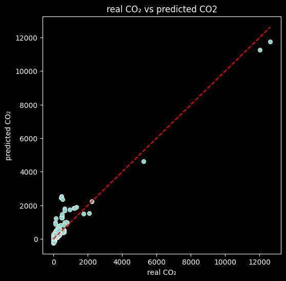
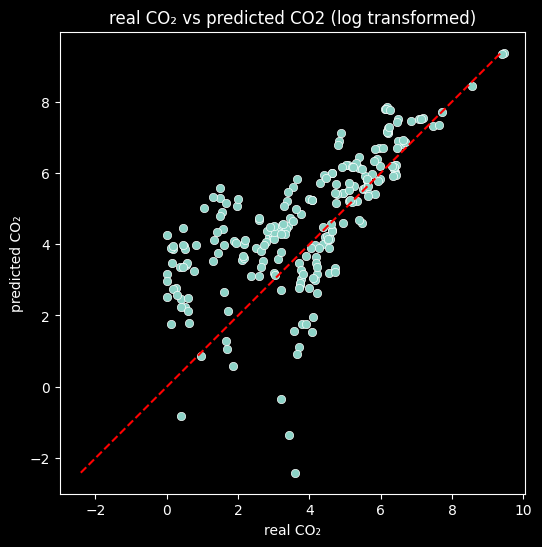
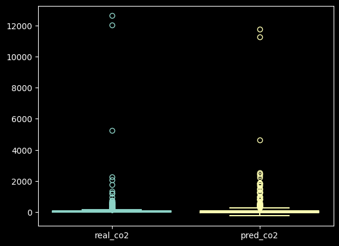
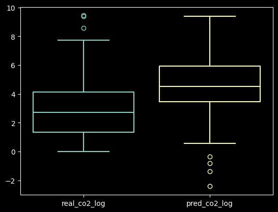

# Question 2: predictive modeling and scenario analysis 

**Task**: Develop a predictive model to forecast CO2 emissions based on the comprehensive set of 
indicators. Use the model to answer an analytical question: “If a country increases its GDP 
by 10%, what is the expected percentage change in CO2 emissions, assuming all other 
factors remain constant?” 

Instructions: 
1. Split the data into training and testing sets. 
2. Train a regression model using the socio-economic and environmental indicators as 
predictors. 
3. Evaluate the model's performance using appropriate metrics (e.g., RMSE, R²). 
4. Simulate the scenario where GDP increases by 10% across different countries, keeping 
other factors constant. 
5. Analyze and interpret the results, providing a range of expected changes in CO2 
emissions across nations.

Deliverable: 
- A script that trains the predictive model, evaluates its performance, and simulates the GDP 
scenario. 
- A Markdown file explaining the choice of model, scenario analysis, and interpretation of 
the results.

## Instructions: 

Please execute all the code chunks in the Q.2.ipynb file (click top button "run all"). 

## 1. Preparation of the data and modeling

To mitigate overfitting, the entire dataset was splited into a training and testing sets with a proportion of 80% and 20%, respectively. The training dataset was used to fit the linear regression, while the testing dataset was used to measure the model's performance. 
Final dimensions were 1856 registers for the training set, and 465 registers for the testing set. 

After analysing the dataset's variables, the column 'country' was discarded (altough saved for final analysis), since was considered an 'id variable' rather than a cathegorical, useful to model, column.

Due to the very different order of magnitude between variables, standard scaler (which is denoted as *𝑧 = 𝑥 − 𝜇 / 𝜎*) was applied to all numerical columns (except the target variable), avoiding bias towards variables of higher values and turning all of them to the same order of magnitude. 

The model chosen was a simple linear regression, where the target variable is the total CO₂ emissions per year (Mt CO2e). 
 
## 2. Results

### 2.1 Evaluation metrics 

The model performance was situable with the processed data (Table 1). 

| Metric     | Value |
|------------|-------|
| MAE        | 128.06|
| RMSE       | 271.98|
| Max Error  | 2062.48|
| R²         | 0.90  |
Table 1. Evaluation metrics of the linear regression. 

As can be seen in Figures 1 and 2, the predicted values show a linear relation with the real, authentic values. 

Figure 1. Scatterplot of real against predicted for the model values. 

Figure 2. Scatterplot of real against predicted for the model values (with logarithm function for visualization purposes).

The predicted values are part of the same space of magnitude than the real values (Figures 3 and 4). Statistical details can be seen in Table 2. 

Figure 3. Boxplot showing the distribution of real and predicted values. 

Figure 4. Scatterplot of real against predicted for the model values (with logarithm function for visualization purposes). 

|        | real_co2 | pred_co2 | error    |
|--------|----------|----------|----------|
| count  | 465.00   | 465.00   | 465.00   |
| mean   | 158.51   | 184.31   | -25.80   |
| std    | 868.04   | 875.47   | 271.04   |
| min    | 0.00     | -241.04  | -2062.48 |
| 25%    | 2.77     | -50.28   | -38.34   |
| 50%    | 14.14    | -1.14    | 28.85    |
| 75%    | 61.26    | 87.66    | 75.89    |
| max    | 12621.61 | 11757.99 | 863.62   |
Table 2. Central tendency and dispersion measures for the error, as well as for the real and predicted values. 

### 2.2 analysis and interpretation 

The complete list of coefficients and their respective value can be seen in Table 3. Population, rural population and GDP were the three variables with more influence on the predictions. As could be expected, population has a strong, positive influence on the emissions, while rural population was also a very important feature altough negatively associated. As always with linear models, interpretation must be done with caution. 

|    | variable           | coef     |
|----|------------------|----------|
| 6  | population        | 2113.37  |
| 9  | rural_pop         | -1502.89 |
| 2  | gdp               | 99.60    |
| 11 | urban_pop         | -71.87   |
| 5  | pop_growth_percen | -64.77   |
| 0  | energy_pc         | 55.99    |
| 12 | urban_pop_growth  | 53.81    |
| 8  | renewables        | -36.09   |
| 7  | food_insecurity   | 32.01    |
| 13 | co2_pc            | 18.85    |
Table 3. Coefficients in ascending order (considering the values as asbsolutes). 

Table 4 lists the ten countries where the model most overestimates emissions, while Table 5 lists the ten countries where the model most underestimates emissions. From Table 4, we can see Brazil has the value reported as max error in Table 1 (2062.48). Is interesting to note that most of the countries reported in Table 4 are low-and middle-income countries, while Table 5 contains China, United States and Russian Federation, suggesting that the model tends to underestimate emissions in high-income or large-emitting countries, while overestimating them in lower-income countries, indicating a potential bias related to economic development and scale of emissions. 

| country        | real_co2 | pred_co2 | error     |
|----------------|----------|----------|-----------|
| Brazil         | 479.50   | 2541.98  | -2062.48  |
| Indonesia      | 656.67   | 1817.67  | -1161.00  |
| Nigeria        | 124.90   | 985.57   | -860.67   |
| Mexico         | 476.06   | 1317.17  | -841.12   |
| Japan          | 1326.71  | 1886.74  | -560.03   |
| France         | 339.35   | 790.95   | -451.61   |
| United Kingdom | 381.29   | 805.73   | -424.45   |
| Pakistan       | 218.68   | 626.10   | -407.42   |
| Turkiye        | 433.75   | 807.58   | -373.83   |
| Philippines    | 161.29   | 505.56   | -344.28   |
Table 4. Countries with over estimated predictions.

| country                | real_co2   | pred_co2   | error     |
|------------------------|------------|------------|-----------|
| China                  | 12621.61   | 11757.99   | 863.62    |
| United States          | 5244.07    | 4625.66    | 618.41    |
| Russian Federation     | 1757.06    | 1486.77    | 270.28    |
| Nauru                  | 0.00       | -223.24    | 223.24    |
| San Marino             | 58.80      | -161.71    | 220.50    |
| Uruguay                | 6.85       | -210.34    | 217.19    |
| Gabon                  | 5.31       | -202.94    | 208.25    |
| Saudi Arabia           | 605.26     | 412.50     | 192.75    |
| Lebanon                | 23.10      | -155.91    | 179.01    |
| Virgin Islands (U.S.)  | 0.00       | -168.13    | 168.13    |
Table 5. Countries with under estimated predictions. 

## 3. Scenario analysis 

*If a country increases its GDP by 10%, what is the expected percentage change in CO2 emissions, assuming all other factors remain constant?*

To answer this question, a new sinthetic vector was created by mutiplying the original 'gdp' variable per 1.1, simulating an increment of 10% and then modeling as before maintaining all the others variables constant. The predictions of this new model were compared with the original one (substracting and dividing by the original) obtaining the percentage of change between scenarios. 

On average, an increment of CO2 emissions of 4% could be expected, with an standard deviation of 46.56. 