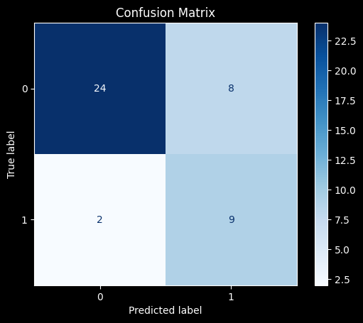
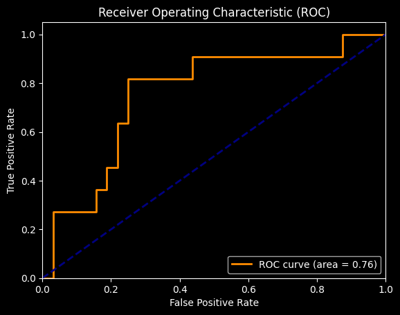
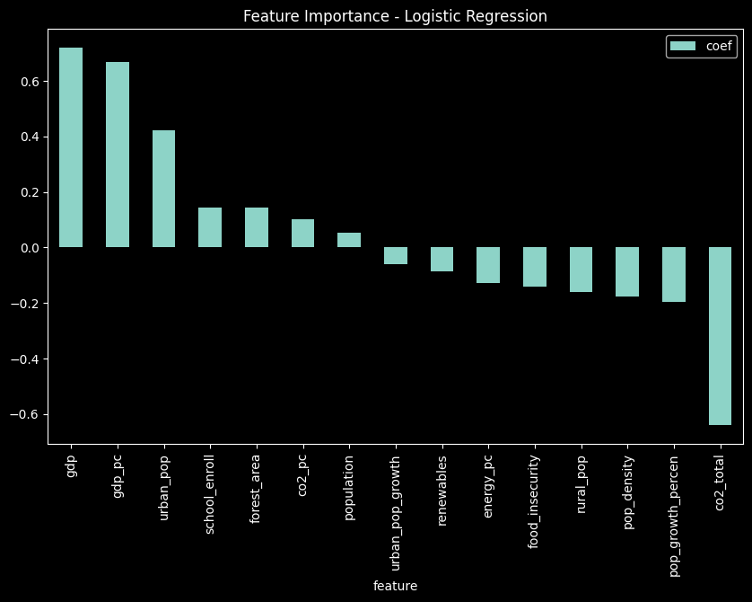

# Question 4: classification and policy implications 

**Task**: Build a classifier to identify countries that are likely to achieve a significant reduction in 
CO2 emissions in the next decade. Answer the business case question: “What are the 
common characteristics of countries that successfully reduce emissions, and how can 
policymakers in other nations apply these insights?” 

Instructions: 
1. Define a binary target variable indicating whether a country is likely to reduce its CO2 
emissions significantly in the next decade. 
2. Train a classification model using the comprehensive set of indicators. 
3. Evaluate the classifier's performance using metrics like accuracy, precision, recall, and F1 
score. 
4. Analyze the key features driving the classification and identify common characteristics of 
successful countries. 
5. Provide policy recommendations based on the insights gained. 

Deliverable: 
- A script that builds and evaluates the classifier. 
- A Markdown file interpreting the classifier's performance, key features, and policy 
implications.

## Instructions: 

Please execute all the code chunks in the Q.4.ipynb file (click top button "run all"). 

## 1. Target variable definition and modeling

The binary variable "target" was created by calculating the reduction rate of each country between 2013 and 2023 and then evaluating a threshold defined as the third quartile (0.75 quantile) of the reductions rate variable. This is, the 25% of countries which more reduced it's emissions were classified as 1, ensuring a reasonable proportion of positive registers. 

The dataset was split into training and testing sets using an 80/20 ratio, maintaining the original class distribution through stratified sampling. Country identifiers were retained separately to allow record-level tracking without influencing model training.

A preprocessing and modeling pipeline was implemented, comprising standardization of all continuous predictors via StandardScaler followed by logistic regression. The logistic regression model was configured with balanced class weights to mitigate the effect of class imbalance, and a maximum of 1000 iterations was allowed to ensure convergence.

The model was trained on the training set and subsequently used to estimate the probability of significant CO2 reduction for each test instance. Binary predictions were obtained by applying a threshold of 0.5 to the predicted probabilities.

## 2. Results 

### 2.1 Evaluation metrics

The classification model achieved an overall accuracy of 0.77 on the test set (Table 1). For the positive class (countries likely to achieve significant CO2 reductions), the model attained a precision of 0.53, a recall of 0.82, and an F1-score of 0.64. This indicates that while only about half of the predicted successful countries were correct (moderate precision), the model successfully identified the majority of true successful cases (high recall). In contrast, the negative class (countries not achieving significant reductions) exhibited higher precision (0.92) but lower recall (0.75), reflecting the typical trade-off in imbalanced datasets. These results suggest that the model is more conservative in detecting successful countries, prioritizing identification of true positives as can be seen in Figure 1, which is critical for informing policymakers seeking to target interventions in nations with potential for meaningful emission reductions. Figure 2 plots the ROC curve, whichs area under the curve is 0.76. 

| Class | Precision | Recall | F1-score | Support |
|-------|-----------|--------|----------|---------|
| 0     | 0.92      | 0.75   | 0.83     | 32      |
| 1     | 0.53      | 0.82   | 0.64     | 11      |
| **Accuracy** |           |        | 0.77     | 43      |
Table 1. Classification metrics.

Figure 1. Confusion matrix for the model; almost all the true positive registers were clasified correctly, altough there is a relatively high proportion of false positives too. 

Figure 2. ROC curve. 

### 2.2 Analysis and interpretation

4. Analyze the key features driving the classification and identify common characteristics of 
successful countries. 

The value of each coefficient can be seen in Figure 3. Altough their interpretation is not as direct as in a normal, continuos regression (since the logistic regression coeffcients are on log-odds scale), they provide a general sense of the importance of each variable on the prediction. Gdp, gdp per capita and urban population are the largest positive coefficients, suggesting countries with high gpd and a large urban population tend to implement measures that reduce emissions, and may have a bbetter infrastructure or policies for this end. Total CO2 emissions is the more extreme negative coefficient, followed by population growt percentage, population density and rural population, showing that countries with high values on this variables probably have more difficulties reducing emissions; this probably reflects structural or demographic challenges that may hinder emission reductions.

Figure 3. Coefficients of the model. 

**Policy recomendations** 

Results suggests that countries succesful at decreasing emissions tend to be economically developed, urbanized, and have higher educational attainment and environmental management. General recommendations should include: 

- Investing in education, food security and general development, as well as in capacity building to support environmental policies.

- Expanding urban planning initiatives that reduce emissions.

- Enhancing forest conservation and sustainable land use.

- Designing targeted interventions in densely populated or rapidly growing areas to overcome structural challenges.

